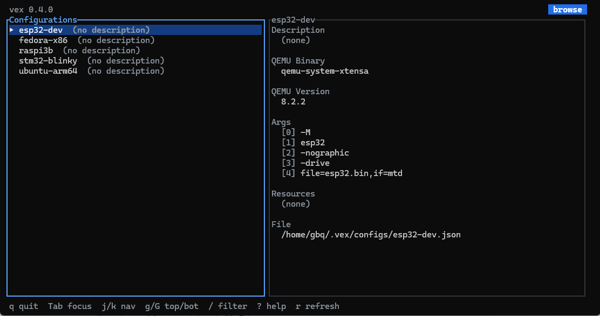
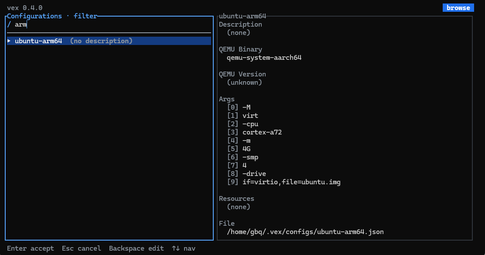
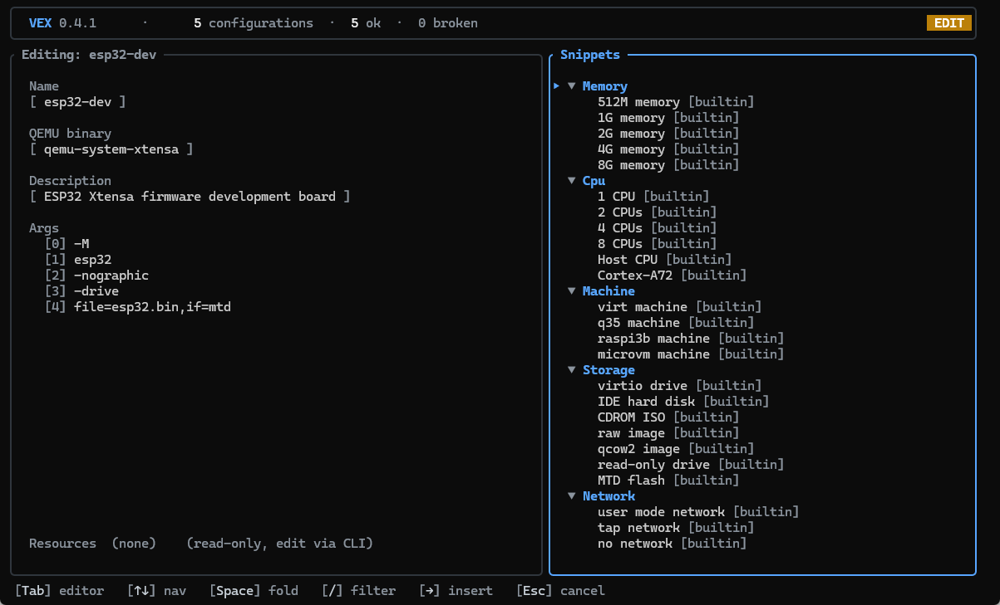
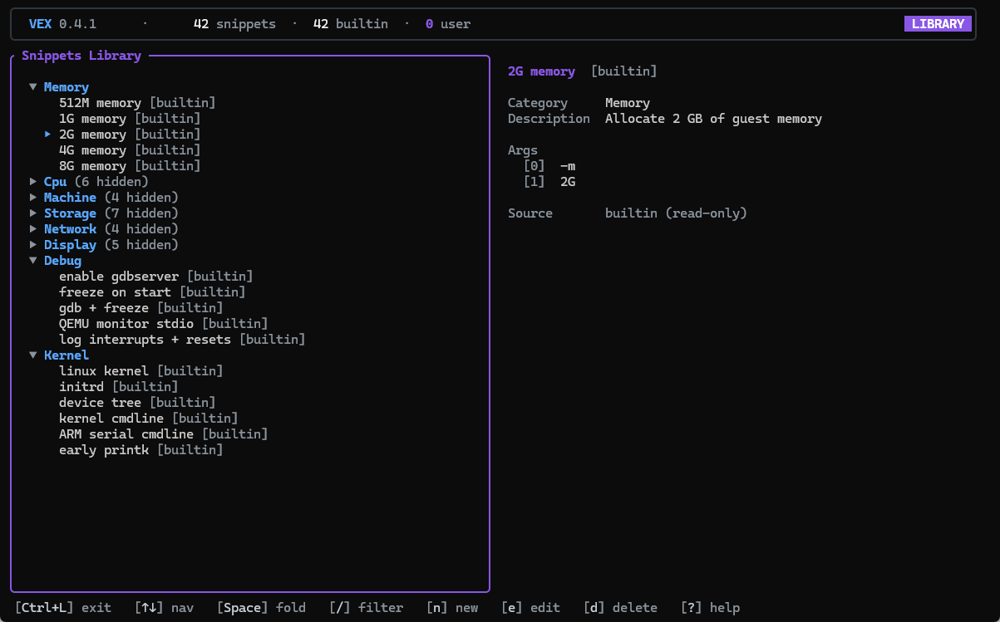
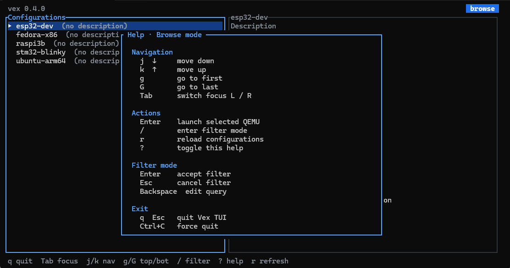
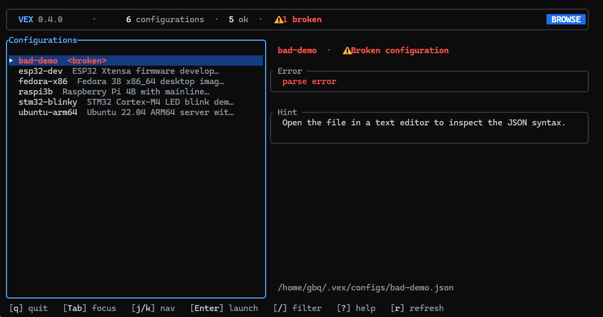

# Interactive TUI

Vex ships with a full-screen terminal UI for browsing, editing, and launching
saved configurations, plus a snippet library for reusing common QEMU argument
recipes.

```
vex tui
```

Browse mode shows your configurations in the left pane and the selected
configuration's details on the right. From there you can launch, edit,
filter, refresh, and reach Library mode.

## Browse mode



| Key       | Action                                |
|-----------|---------------------------------------|
| j / ↓     | Move selection down                   |
| k / ↑     | Move selection up                     |
| g         | Jump to first configuration           |
| G         | Jump to last configuration            |
| Tab       | Switch focus between list and details |
| Enter     | Launch selected configuration in QEMU |
| e         | Edit selected configuration           |
| n         | Create a new configuration            |
| /         | Enter filter mode                     |
| r         | Reload configurations from disk       |
| Ctrl+L    | Open Library mode                     |
| ?         | Toggle help overlay                   |
| q / Esc   | Quit TUI                              |
| Ctrl+C    | Force quit                            |

## Filter mode



Press `/` to filter the list by name or description. Type to refine,
`Enter` to accept (keep filter active), or `Esc` to clear. The top bar
shows match counts while a filter is active.

## Edit mode



Press `e` on a configuration to edit it, or `n` to create a new one.
The Edit pane has four fields: **name**, **QEMU binary**, **description**,
and **args**. Resources remain CLI-managed (`vex resource`); the TUI does
not edit them.

- `Tab` switches focus between the Editor (left) and the Snippets drawer
  (right).
- `↑` / `↓` cycle fields in the Editor; in the Args field they navigate
  rows. `←` / `→` move the cursor inside text fields.
- In the Args field:
  - `a` adds an empty arg and immediately starts editing it.
  - `Enter` edits the currently-selected arg token in place.
  - `J` / `K` reorder the selected arg down / up.
  - `d` deletes the selected arg.
  - While editing a token: `Enter` / `Esc` commit.
- `Ctrl+S` saves and exits. Empty arg tokens are stripped on save so an
  abandoned `a`-then-cancel never reaches QEMU as `""`.
- `Esc` cancels; if there are unsaved changes, the TUI prompts to confirm
  discard.

## Snippets drawer

The right pane of Edit mode shows the merged snippet library (builtin +
user) grouped by category. Press `Tab` to focus it, then:

- `↑` / `↓` to navigate, `Space` to fold/unfold a category.
- `/` to filter snippets by name or description, `Enter` accepts and
  `Esc` clears, same as the Browse-mode filter.
- `→` inserts the selected snippet's args at the current Args field
  position in the Editor.

Each row carries a `[builtin]` or `[user]` badge based on whether the
snippet is in your user library — overrides of builtin names are still
labelled `[user]`.

## Library mode



Press `Ctrl+L` from Browse mode to open the full-screen snippet manager.
It lists every snippet with a details panel on the right.

- `n` create a new user snippet.
- `e` edit the selected snippet — allowed for pure user snippets and for
  user overrides of builtin names.
- `d` delete the selected user snippet (with a confirm modal).

A snippet is "manageable" when an entry with the same name exists in your
user library (`~/.vex/snippets.json`). Pure builtins with no override are
read-only; pressing `e` or `d` on one shows a hint pointing to `n`. The
write path is atomic (temp-file + rename on POSIX) and is also gated:
if `snippets.json` exists but fails to parse, Library mode enters a
read-only state and writes are refused — your file is never overwritten
with an empty baseline.

## Help overlay



Press `?` from any mode to toggle the help overlay. It lists the
keybindings relevant to the current mode (Browse, Filter, Edit, Library)
and is panic-safe on very small terminals.

## Broken configurations



A config file that fails to parse or fails validation shows up in the
list with a visible error state and an actionable hint (e.g. "JSON parse
error" with the offending field). Launch is refused; `e` opens the file
in edit mode so you can fix it.

## Snippets system

A **snippet** is a named, categorised piece of QEMU args. Vex ships
with 42 builtin snippets across 8 categories — Memory, CPU, Machine,
Storage, Network, Display, Debug, Kernel — covering the most common
QEMU recipes. Users add their own via Library mode; the file lives at
`~/.vex/snippets.json` (or `$VEX_CONFIG_DIR/snippets.json` when
`VEX_CONFIG_DIR` is set).

Merge rules:

- A user entry whose `name` matches a builtin overrides that builtin
  in-place (preserving position in the category).
- User-only entries (name not used by any builtin) append at the end of
  their category.
- Builtin entries are never written to the user file.

Snippet name validation is more permissive than config-name validation:
non-empty after trim, ≤ 64 characters, no control characters. Spaces,
punctuation, and non-ASCII letters are all allowed — that's what makes
overrides of builtins like `"1G memory"` possible.

## Requirements

- A terminal at least 100 columns wide is recommended.
- The TUI uses the alternate screen and raw mode; it cleanly restores
  the terminal on exit, error, or panic.
